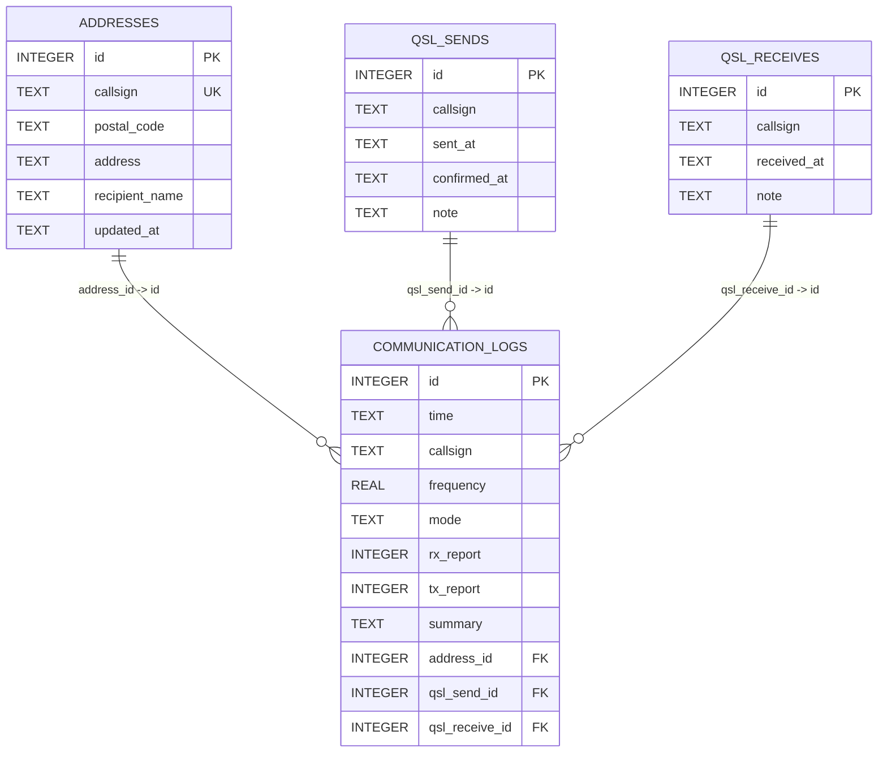

# Logbook 数据库指南

本文档记录 `data/logbook.db` 的实际 SQLite 架构及当前服务端读模型。元数据于 2026-08-17 读取；记录数和数据范围会随写入而变化。

## 概览

| 项目 | 值 |
| --- | --- |
| 数据库引擎 | SQLite 3.52.0 |
| 编码 | UTF-8 |
| 页大小 | 4096 字节 |
| 日志模式 | WAL |
| `user_version` | 2 |
| 业务表 | `communication_logs`、`addresses`、`qsl_sends`、`qsl_receives`、`callsign_email_cache` |
| 视图 / 触发器 | 无 / 无 |
| 自动增长状态 | 五张业务表均以 `INTEGER PRIMARY KEY AUTOINCREMENT` 生成主键 |

`sqlite_sequence` 为 SQLite 自动维护的内部表，不应由应用直接修改。

## 实体关系



`communication_logs` 是通联记录主表。三条关联均为可选关系：删除被引用的地址或 QSL 记录时，关联列被置为 `NULL`；被引用主键更新时级联更新。

新增或更新地址、QSL 发件记录、QSL 收件记录时，服务会在同一事务内回填同呼号且对应外键为 `NULL` 的通联记录；已有外键关联不会被新记录覆盖。

| 子表字段 | 引用目标 | `ON DELETE` | `ON UPDATE` |
| --- | --- | --- | --- |
| `communication_logs.address_id` | `addresses.id` | `SET NULL` | `CASCADE` |
| `communication_logs.qsl_send_id` | `qsl_sends.id` | `SET NULL` | `CASCADE` |
| `communication_logs.qsl_receive_id` | `qsl_receives.id` | `SET NULL` | `CASCADE` |

## 表定义

### `addresses`

地址簿；以呼号唯一标识一条最新地址记录。

| 字段 | SQLite 类型 | 可空 | 约束 | 说明 |
| --- | --- | --- | --- | --- |
| `id` | `INTEGER` | 否 | PK，AUTOINCREMENT | 内部标识 |
| `callsign` | `TEXT` | 否 | UNIQUE | 对方呼号 |
| `postal_code` | `TEXT` | 否 | 无 | 邮政编码 |
| `address` | `TEXT` | 否 | 无 | 邮寄地址 |
| `recipient_name` | `TEXT` | 是 | 无 | 收件人 |
| `updated_at` | `TEXT` | 是 | 无 | 地址更新日期 |

### `communication_logs`

通联记录。时间、模式和摘要等数据均保留为应用层约定的文本；数据库未定义格式检查或默认值。

| 字段 | SQLite 类型 | 可空 | 约束 | 说明 |
| --- | --- | --- | --- | --- |
| `id` | `INTEGER` | 否 | PK，AUTOINCREMENT | 通联记录序号；API 映射为 `sequenceNumber` |
| `time` | `TEXT` | 否 | 无 | 通联时间；服务按其文本值排序 |
| `callsign` | `TEXT` | 否 | 无 | 对方呼号 |
| `frequency` | `REAL` | 否 | 无 | 通联频率 |
| `mode` | `TEXT` | 否 | 无 | 通联模式 |
| `rx_report` | `INTEGER` | 否 | 无 | 接收报告 |
| `tx_report` | `INTEGER` | 否 | 无 | 发送报告 |
| `summary` | `TEXT` | 是 | 无 | 通联摘要 |
| `address_id` | `INTEGER` | 是 | FK -> `addresses.id` | 关联地址 |
| `qsl_send_id` | `INTEGER` | 是 | FK -> `qsl_sends.id` | 关联 QSL 发件记录 |
| `qsl_receive_id` | `INTEGER` | 是 | FK -> `qsl_receives.id` | 关联 QSL 收件记录 |

### `qsl_sends`

QSL 发件记录。一条呼号可保留多次发件历史；`callsign` 未设唯一约束。

| 字段 | SQLite 类型 | 可空 | 约束 | 说明 |
| --- | --- | --- | --- | --- |
| `id` | `INTEGER` | 否 | PK，AUTOINCREMENT | 内部标识 |
| `callsign` | `TEXT` | 否 | 无 | 对方呼号 |
| `sent_at` | `TEXT` | 否 | 无 | 发件日期 |
| `confirmed_at` | `TEXT` | 是 | 无 | 对方确认收到卡片的时间；`NULL` 表示未确认 |
| `note` | `TEXT` | 是 | 无 | 备注；当前只读 API 未返回 |

### `qsl_receives`

QSL 收件记录。一条呼号可保留多次收件历史；`callsign` 未设唯一约束。

| 字段 | SQLite 类型 | 可空 | 约束 | 说明 |
| --- | --- | --- | --- | --- |
| `id` | `INTEGER` | 否 | PK，AUTOINCREMENT | 内部标识 |
| `callsign` | `TEXT` | 否 | 无 | 对方呼号 |
| `received_at` | `TEXT` | 否 | 无 | 收件日期 |
| `note` | `TEXT` | 是 | 无 | 备注；当前只读 API 未返回 |

### `callsign_email_cache`

呼号邮箱缓存历史。`callsign` 是查询键而非唯一约束，因此同一呼号可保存多条不同邮箱或来源的记录；读取时按 `updated_at DESC, id DESC` 取最新一条。写入邮箱与该呼号、该来源的最新缓存相同时，仅更新原记录的 `updated_at`，不会新增记录；不同来源的记录不会相互更新。

| 字段 | SQLite 类型 | 可空 | 约束 | 说明 |
| --- | --- | --- | --- | --- |
| `id` | `INTEGER` | 否 | PK，AUTOINCREMENT | 内部排序标识，不对 API 暴露 |
| `callsign` | `TEXT` | 否 | 无 | 大写规范化后的查询呼号 |
| `email` | `TEXT` | 否 | 无 | 缓存的邮箱地址 |
| `updated_at` | `TEXT` | 否 | 无 | 更新时间，格式为 `YYYY-MM-DD HH:mm` |
| `provider` | `TEXT` | 否 | 无 | 数据来源，例如 `select:qrz.com` 或 `manual` |

## 索引

除 `addresses.callsign` 的唯一约束自动生成的索引外，数据库有 10 个显式索引。全部为非唯一、非部分索引。

| 表 | 索引 | 字段顺序 | 用途 / 备注 |
| --- | --- | --- | --- |
| `addresses` | `sqlite_autoindex_addresses_1` | `callsign` | UNIQUE 约束自动创建，负责唯一性和按呼号查询 |
| `addresses` | `idx_addresses_callsign` | `callsign` | 与上述唯一索引键列相同 |
| `communication_logs` | `idx_communication_logs_time` | `time` | 全部通联记录按时间排序 |
| `communication_logs` | `idx_communication_logs_callsign` | `callsign` | 按呼号筛选 |
| `communication_logs` | `idx_communication_logs_callsign_time_id` | `callsign`, `time`, `id` | 按呼号、时间和序号排序 |
| `communication_logs` | `idx_communication_logs_callsign_time_frequency` | `callsign`, `time`, `frequency` | 服务启动时以 `CREATE INDEX IF NOT EXISTS` 确保存在 |
| `communication_logs` | `idx_communication_logs_address_id` | `address_id` | 地址关联查找与外键维护 |
| `communication_logs` | `idx_communication_logs_qsl_send_id` | `qsl_send_id` | QSL 发件关联查找与外键维护 |
| `communication_logs` | `idx_communication_logs_qsl_receive_id` | `qsl_receive_id` | QSL 收件关联查找与外键维护 |
| `qsl_sends` | `idx_qsl_sends_callsign` | `callsign` | 按呼号筛选发件记录 |
| `qsl_receives` | `idx_qsl_receives_callsign` | `callsign` | 按呼号筛选收件记录 |
| `callsign_email_cache` | `idx_callsign_email_cache_callsign_updated_at_id` | `callsign`, `updated_at DESC`, `id DESC` | 按呼号获取最新邮箱缓存 |

`idx_addresses_callsign` 与唯一自动索引使用相同键列；SQLite 可使用唯一自动索引完成相同的等值查询。是否移除显式重复索引应在确认没有写入端依赖其名称后通过迁移处理。

## 当前数据快照

以下为元数据采集时的只读快照，不属于模式约束。

| 表 | 记录数 |
| --- | ---: |
| `communication_logs` | 24 |
| `addresses` | 15 |
| `qsl_sends` | 15 |
| `qsl_receives` | 1 |

- 通联时间范围：`2026-08-05 14:29` 至 `2026-08-15 15:39`。
- 24 条通联均关联地址与 QSL 发件记录，5 条关联 QSL 收件记录。
- `PRAGMA foreign_key_check` 未发现违规；三个外键的悬空引用数均为 0。

## 服务端读模型

`server/database/select.ts` 是当前数据库访问层。通联日志列表与按呼号查询都只读取 `communication_logs`，不再联接地址或 QSL 表，也不返回地址或 QSL 明细。`address_id`、`qsl_send_id` 和 `qsl_receive_id` 分别映射为 `hasAddress`、`qslSent` 与 `qslReceived` 布尔值，非 `NULL` 时为 `true`。列表查询可按这三个外键状态筛选；按呼号去重时，在筛选结果中通过窗口函数按 `time DESC, id DESC` 保留每个呼号的最新记录。地址簿和 QSL 收发记录提供按呼号批量查询，输入呼号会规范化、去重后以参数化 `IN` 条件查询各自的单表。数据库列名与 API 字段的主要映射如下。

| 数据库列 | API 字段 |
| --- | --- |
| `communication_logs.id` | `sequenceNumber` |
| `rx_report` / `tx_report` | `rxReport` / `txReport` |
| `address_id IS NOT NULL` | `hasAddress` |
| `qsl_send_id IS NOT NULL` | `qslSent` |
| `qsl_receive_id IS NOT NULL` | `qslReceived` |

按呼号查询前，服务会使用 `toUpperCase()` 规范化查询参数；写入数据时也应统一存储大写呼号，避免 SQLite 默认二进制文本比较产生大小写不匹配。通联列表按 `time DESC, id DESC` 排序，按呼号的通联列表也采用该顺序。为使文本排序等同于时间顺序，应持续使用零填充、从高到低排列的格式，例如 `YYYY-MM-DD HH:mm` 或 `YYYY-MM-DD HH:mm:ss`。

## 维护注意事项

- SQLite 的外键定义默认不会自动启用。实测当前只读连接的 `PRAGMA foreign_keys` 为 `0`；任何负责写入或删除的连接都应在打开后执行 `PRAGMA foreign_keys = ON`，否则 `ON DELETE SET NULL`、级联更新和外键校验不会生效。
- 服务启动时会执行可重复的模式迁移；当前 `PRAGMA user_version` 为 `2`。变更表结构、索引或约束时，应同步更新迁移与版本号。
- 日期和时间字段均是 `TEXT`，且未由 `CHECK` 约束验证；应用层必须负责格式与时区约定。
- `note` 字段和 QSL 记录的内部 `id` 未暴露给现有只读 API。扩展接口时需决定是否公开这些字段。

## 检查命令

使用项目依赖的 `sqlite3` 驱动执行以下检查：

```powershell
node --input-type=module -e 'import sqlite3 from "sqlite3"; const db = new sqlite3.Database("data/logbook.db", sqlite3.OPEN_READONLY); db.all("PRAGMA foreign_key_check", (error, rows) => { if (error) throw error; console.log(rows); db.close(); });'
```

结果为空数组表示未发现已存在的外键违反记录。该命令只检查数据，不会更改数据库。
