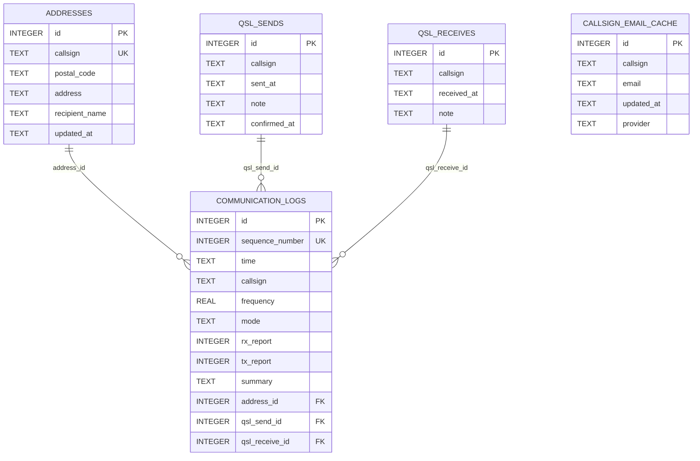

# 数据库

项目使用 `data/logbook.db` 中的 SQLite 数据库。本页结构已根据当前数据库的 `sqlite_master`、外键信息和服务端迁移代码核实；数据量等易变化内容不作为文档固定快照。

## 概览

- `PRAGMA user_version = 3`
- 五张业务表：`communication_logs`、`addresses`、`qsl_sends`、`qsl_receives`、`callsign_email_cache`
- 无业务视图或触发器
- 所有业务表均使用 `INTEGER PRIMARY KEY AUTOINCREMENT`
- 服务端连接会启用 SQLite 外键

## 实体关系

三个通联外键均允许 `NULL`，使用 `ON DELETE SET NULL` 和 `ON UPDATE CASCADE`。

## 表结构

### `communication_logs`

| 列 | 类型 | 可空 | 约束/说明 |
| --- | --- | --- | --- |
| `id` | INTEGER | 否 | 主键，自增 |
| `time` | TEXT | 否 | 通联时间；应用按文本排序 |
| `callsign` | TEXT | 否 | 呼号 |
| `frequency` | REAL | 否 | 频率 |
| `mode` | TEXT | 否 | 模式 |
| `rx_report` | INTEGER | 否 | 接收报告 |
| `tx_report` | INTEGER | 否 | 发送报告 |
| `summary` | TEXT | 是 | 摘要 |
| `address_id` | INTEGER | 是 | 外键到 `addresses.id` |
| `qsl_send_id` | INTEGER | 是 | 外键到 `qsl_sends.id` |
| `qsl_receive_id` | INTEGER | 是 | 外键到 `qsl_receives.id` |
| `sequence_number` | INTEGER | 否 | 默认 0，由唯一索引保证唯一 |

数据库本身没有日期格式或报告范围的 `CHECK`，约束由应用层 Ajv 执行。

### `addresses`

| 列 | 类型 | 可空 | 约束/说明 |
| --- | --- | --- | --- |
| `id` | INTEGER | 否 | 主键，自增 |
| `callsign` | TEXT | 否 | UNIQUE；每个呼号最多一个当前地址 |
| `postal_code` | TEXT | 否 | 邮政编码 |
| `address` | TEXT | 否 | 邮寄地址 |
| `recipient_name` | TEXT | 是 | 收件人 |
| `updated_at` | TEXT | 是 | 更新时间；数据库允许空，当前 API 写入非空值 |

### `qsl_sends`

| 列 | 类型 | 可空 | 说明 |
| --- | --- | --- | --- |
| `id` | INTEGER | 否 | 主键，自增 |
| `callsign` | TEXT | 否 | 呼号；不唯一，可保存历史 |
| `sent_at` | TEXT | 否 | 发件日期 |
| `note` | TEXT | 是 | 备注；当前 API 未公开 |
| `confirmed_at` | TEXT | 是 | 对方确认日期；由版本迁移补充 |

### `qsl_receives`

| 列 | 类型 | 可空 | 说明 |
| --- | --- | --- | --- |
| `id` | INTEGER | 否 | 主键，自增 |
| `callsign` | TEXT | 否 | 呼号；不唯一，可保存历史 |
| `received_at` | TEXT | 否 | 收件日期 |
| `note` | TEXT | 是 | 备注；当前 API 未公开 |

### `callsign_email_cache`

| 列 | 类型 | 可空 | 说明 |
| --- | --- | --- | --- |
| `id` | INTEGER | 否 | 主键，自增，也是相同时间的排序依据 |
| `callsign` | TEXT | 否 | 规范化呼号 |
| `email` | TEXT | 否 | 邮箱 |
| `updated_at` | TEXT | 否 | 更新时间 |
| `provider` | TEXT | 否 | 来源，例如 `select:qrz.com` |

该表保留历史，而非每呼号唯一。读取按 `updated_at DESC, id DESC` 取最新项；同一来源的最新邮箱未变化时只刷新时间。

## 索引

| 表 | 索引 | 列 |
| --- | --- | --- |
| `addresses` | 自动唯一索引 | `callsign` |
| `addresses` | `idx_addresses_callsign` | `callsign` |
| `communication_logs` | `idx_communication_logs_time` | `time` |
| `communication_logs` | `idx_communication_logs_time_id` | `time DESC, id DESC` |
| `communication_logs` | `idx_communication_logs_sequence_number` | `sequence_number`，UNIQUE |
| `communication_logs` | `idx_communication_logs_callsign` | `callsign` |
| `communication_logs` | `idx_communication_logs_callsign_time_id` | `callsign, time, id` |
| `communication_logs` | `idx_communication_logs_callsign_time_frequency` | `callsign, time, frequency` |
| `communication_logs` | `idx_communication_logs_address_id` | `address_id` |
| `communication_logs` | `idx_communication_logs_qsl_send_id` | `qsl_send_id` |
| `communication_logs` | `idx_communication_logs_qsl_receive_id` | `qsl_receive_id` |
| `qsl_sends` | `idx_qsl_sends_callsign` | `callsign` |
| `qsl_receives` | `idx_qsl_receives_callsign` | `callsign` |
| `callsign_email_cache` | `idx_callsign_email_cache_callsign_updated_at_id` | `callsign, updated_at DESC, id DESC` |

`idx_addresses_callsign` 与 UNIQUE 约束自动索引重复，但它属于当前实际数据库结构；移除前应通过正式迁移评估。

## 关联和写入语义

- 新增通联时关联该呼号当前地址、最新 QSL 发件和最新 QSL 收件。
- upsert 地址后，为同呼号且尚无地址关联的所有通联补充外键。
- 新增 QSL 发件或收件后，为同呼号且对应外键为空的通联补充关联。
- 已存在的关联不会因后续地址或 QSL 历史记录而覆盖。
- 删除关联实体时，启用外键的连接会把通联外键设为 `NULL`。

## 迁移边界

当前迁移可以从旧版本增量更新到版本 3，但不能从全空 SQLite 文件创建所有核心表。`callsign_email_cache` 是唯一由现有迁移完整创建的业务表；其他核心表必须已存在。备份和部署时应把数据库文件视为必要运行资产。

## 维护建议

- 在任何新增数据库连接上执行 `PRAGMA foreign_keys = ON`。
- 始终使用零填充的 `YYYY-MM-DD` 或 `YYYY-MM-DD HH:mm`，保持文本排序与时间排序一致。
- 不要手动修改 `sqlite_sequence`。
- 修改表结构时同步更新迁移、`user_version`、共享模型和本文档。
- 数据写入前备份 `data/logbook.db`；`data/backups/` 可用于保存维护前副本。
- `sequence_number` 如与 `time ASC, id ASC` 不一致，使用服务端维护参数修复，不应直接逐行交换唯一值。
